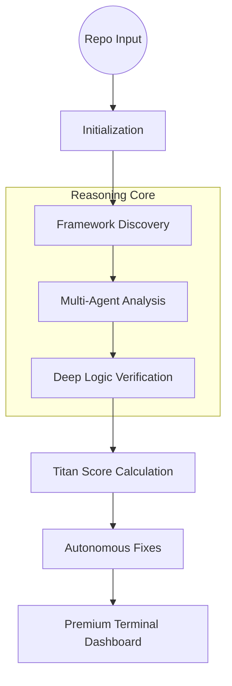

<div align="center">

# ⚡ TITAN AI
### **The World’s First Cognitive Code Architect & Autonomous Debugging Titan**
*Where human expertise meets wire-speed intelligence.*

<br/>

[](https://deepseek.com)
[](https://langchain-ai.github.io/langgraph/)
[](https://owasp.org)
[]()

<br/>

**[Website](https://github.com/daniellopez882/Debugging-and-Code-Analyizer-Agent)** • **[Architecture](#-the-cognitive-engine)** • **[Personas](#-engineer-personas)** • **[Quick Start](#-orbital-deployment)**

---

</div>

## 💎 The Engineering Manifesto

Traditional linting is dead. Static analysis is a commodity. In the era of hyper-scale systems, **Code Rot** is the silent killer of innovation. 

**TitanAI** is not a tool; it is a **Cognitive Orchestrator**. It doesn't just scan syntax; it reasons through your architecture, predicts logical failures, and autonomously crafts surgical code repairs before they ever reach production. 

---

## 🚀 Titan-Grade Capabilities

### 🧠 **11-Phase Cognitive Pipeline**
TitanAI executes a strictly orchestrated reasoning graph powered by **LangGraph**. It views code through 11 distinct dimensions:
- **Static Integrity**: Beyond basic linting.
- **Architectural Drift**: Detecting pattern violations in real-time.
- **Deep Security Audit**: Scanning for CWE Top 25 with LLM contextual reasoning.
- **Performance Profiling**: Identifying O(n) bottlenecks and memory leaks.
- **Logic Intelligence**: Verifying function intent vs. implementation.

### 🎭 **Engineer Personas**
Static reviews are boring. Scale your team with virtual specialists:
- **The Grand Architect**: Professional, structural, and focused on patterns.
- **The Supportive Mentor**: Educational and growth-oriented.
- **Security Chief**: Paranoid, thorough, and uncompromising on safety.

### 📊 **The Titan Score™**
Your codebase now has a credit score. TitanAI aggregates findings into a single, high-fidelity grade (A+ to F), allowing executives and leads to see health at a glance.

---

## 🏗️ The Cognitive Engine



---

## 🌌 Experience the Premium UI

TitanAI doesn't just output text. It generates a **High-Fidelity Terminal Dashboard** using `rich`. Tables, progress bars, and color-coded grade panels ensure that the review process is as beautiful as it is powerful.

---

## 🔧 Orbital Deployment

### 1. Installation
```bash
# Clone the orbital repository
git clone https://github.com/daniellopez882/Debugging-and-Code-Analyizer-Agent.git
cd Debugging-and-Code-Analyizer-Agent

# Install high-performance dependencies
pip install -r requirements.txt
```

### 2. Configure Your Core
Create a `.env` in the root and add your intelligence provider:
```env
GOOGLE_API_KEY=your_orbital_key
```

### 3. Initiate Review
```bash
python main.py
```

---

## 🔭 Roadmap to Singularity

- [x] **Cyclic State Machine**: LangGraph integration.
- [x] **Premium UI/UX**: Terminal Dashboard.
- [x] **Persona Engine**: Context-aware reviews.
- [ ] **Cross-File Dependency Context**: Mapping an entire ecosystem.
- [ ] **Autonomous PR Creation**: Closing the loop on fixes.

<br/>

<div align="center">

**Built for the 1%. Powered by Titan-Level Intelligence.**

*TitanAI: Code with the clarity of a Principal Architect.*

Built with ❤️ by [Ismail Sajid](https://github.com/Ismail-2001)

</div>
