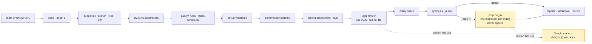

# Code review agent

A command-line reviewer for Python repositories: it clones a repository, runs
pylint, radon complexity and a set of pattern rules over the files in scope,
asks a Google model to comment on each file's logic, grades the result, and
writes Markdown and JSON reports. On request it also asks the model to propose
fixes, which go into the report and are never applied.

[](https://github.com/daniellopez882/Cognitive-Code-Architect-Debugging-Agent/actions/workflows/ci.yml)

> **On the claims.** The previous README ("TITAN AI — The World's First
> Cognitive Code Architect & Autonomous Debugging Titan") promised "surgical
> code repairs before they ever reach production", "wire-speed intelligence",
> a "Titan Score™" and an "Audit Certified" badge linking to OWASP. What runs
> is pylint, radon, a handful of regular-expression rules, one model call per
> file, and — when asked — model proposals that no one applies. Where a number
> appears below, the command that produced it appears beside it.

> **Origin.** The `LICENSE` file names Ismail as copyright holder; the same
> author's work is the base of two other repositories on this account. This
> repository is a hardening of that code and is presented as such, not as
> original work.

---

## What runs


```mermaid
flowchart LR
    CLI[main.py review URL] --> INIT[clone · depth 1] --> SCOPE[scope: full · branch · files · diff]
    SCOPE --> SA[pylint via subprocess] --> PA[pattern rules · radon complexity] --> SEC[security patterns]
    SEC --> PERF[performance patterns] --> TEST[testing assessment · stub] --> LOGIC[logic review<br/>one model call per file]
    LOGIC --> POL[policy check] --> SYN[synthesis · grade]
    SYN -->|--auto-fix| FIX[propose_fix<br/>one model call per finding<br/>never applied]
    SYN -->|default| REP[reports · Markdown + JSON]
    FIX --> REP
    LOGIC & FIX -.->|built on first use| LLM[Google model · GOOGLE_API_KEY]
    classDef gate fill:#fef3c7,stroke:#d97706
    class FIX,LLM gate
```

The graph is LangGraph; every node in it is a real implementation
([ADR 0002](docs/adr/0002-the-graph-wires-real-nodes-behind-one-model-seam.md)).
Two nodes are stubs and say so in their code: `assess_testing_node` runs no
tests, and `run_security_audit_node` applies patterns only. The logic review
turns the model's reply into one medium finding per file; parsing structured
findings out of it is future work.

## What was fixed

Reproduced on the original code before each fix; every row has a test or a CI
probe.

### In the pull request

| Defect | Consequence |
|---|---|
| `graph.py` defined twelve stub nodes shadowing `nodes.py` | The workflow ran placeholders; ~300 lines of real analysis were unreachable |
| Two divergent source trees (root and `src/`); README ran one, CI the other | Only one imported; the tests errored at collection |
| The model was built at import time | Importing the graph needed the provider package and a key; no hermetic test was possible |
| Reviewed source interpolated into a `ChatPromptTemplate` | Any file with a dict literal or f-string raised `KeyError` — most real Python; also an injection path |
| `radon` invoked as a CLI not on `PATH`, failure swallowed by a bare `except` | Complexity silently reported nothing |
| The only workflow ran the reviewer against itself and needed a secret that was never set | Every CI run in the repository's history failed in ten to thirteen seconds; nothing else was checked |
| Committed build artefacts | — |

### In the follow-up (2026-09-06)

| Defect | Consequence |
|---|---|
| `--auto-fix` defaulted to `True` and the graph was compiled with `interrupt_before=["fix_generation"]` that the CLI never resumed | The default invocation stopped after synthesis and wrote **no report**. Proposals are opt-in and the interrupt is gone ([ADR 0003](docs/adr/0003-fixes-are-proposals-off-by-default.md)) |
| `generate_fixes_node` emitted `def fixed_function():\n    pass` for every issue, labelled `valid_syntax`; the reporter ignored fixes | Placeholder "fixes" nobody saw. The model now proposes a fix per finding, the block is syntax-checked, the record carries `applied: False`, the report shows it under "Proposed fixes (not applied)" |
| No container image | Two-stage `python:3.12-slim` image, uid 10001, `git` installed for GitPython, entrypoint is the CLI; CI builds it, runs `--help` inside it and checks the uid ([ADR 0004](docs/adr/0004-a-cli-image-with-what-the-code-imports.md)) |
| `requirements.txt` pinned about thirty packages the code never imports (`semgrep`, `py-spy`, `safety`, `tree-sitter`, `reportlab`, `PyGithub`, `python-gitlab`, `black`, `flake8`, `mypy`, …) | A far larger install and attack surface than the code; the list now matches the imports and a test enforces it |
| `bandit` was `continue-on-error: true`; no dependency audit | Both fail the build now |
| `review` passed `local_path=""` for every target, so the initialisation node cloned into an empty path and raised `FileNotFoundError` before any analysis | **The CLI could not review anything**, URL or directory. Found by running the image on a mounted directory. A directory is now reviewed in place; a URL is cloned into a temporary directory that is removed afterwards; a run that does not finish exits 1 instead of 0 with no report |
| `initialize_repository_node` replaced the caller's `local_path` with `"."` for local targets | The integration test analysed this repository's own tree instead of its fixture — which is why the suite took 101 s. It keeps the given path now, and the suite runs in about 7 s |
| `config_loader` defaulted `auto_fix.enabled` to `True`; `.env.example` listed GitHub and GitLab tokens and cache settings nothing reads | Aligned with the CLI default and with what the code reads |

## Quick start

```bash
git clone https://github.com/daniellopez882/Cognitive-Code-Architect-Debugging-Agent.git
cd Cognitive-Code-Architect-Debugging-Agent
python -m venv .venv && .venv/bin/pip install -r requirements-dev.txt
.venv/bin/pytest -q
cp .env.example .env          # GOOGLE_API_KEY for the model stages
.venv/bin/python main.py review https://github.com/some/repo --output ./reports
.venv/bin/python main.py review /path/to/checkout --auto-fix      # add proposals to the report
```

Without `GOOGLE_API_KEY`, `--help`, cloning and the static stages run; the
first model call raises and is reported.

Container:

```bash
docker build -t codeguardian .
docker run --rm -e GOOGLE_API_KEY=... -v "$PWD/reports:/app/reports" codeguardian review https://github.com/some/repo
```

## Options

| Option | Default | Notes |
|---|---|---|
| `--scope` | `full` | `branch`, `files`, `diff`, `security_only`, `performance_only` |
| `--files` | — | Comma-separated paths; read from disk as given |
| `--severity` | `medium` | Minimum severity reported |
| `--auto-fix` | **off** | Ask the model to propose fixes; proposals go into the report, nothing is written to the repository |
| `--format` | `markdown` | `json`, `html`, `all` |
| `--output` | `./reports` | Where reports are written |

## Testing

```bash
pytest -q
```

45 tests, all offline (`45 passed` on 2026-09-06). The suite could not be
collected before the pull request; it had 27 tests after it. A deterministic
fake chat model is installed for the whole session through `agents.nodes.set_llm`,
so no test reaches Google. The tests cover the analyzers, the full graph with
and without proposals, the proposal parser (code block, bad syntax, no block,
provider failure), that the repository is never written, the reporter, the
`review` command end to end on a directory (a report is written; a failed run
exits 1), target resolution, and the CLI default for proposals.

## Security

Implemented: reviewed code is read and never executed (pylint and radon are
static; the clone is `depth=1`); model prompts carry the code as data with an
explicit untrusted-input instruction; proposals are never applied; the image
runs as uid 10001; `bandit` and `pip-audit` fail the build; nothing needs the
key at start.

**Not implemented:** a budget on model calls (one per file, plus one per
finding with `--auto-fix`), an allowlist for `--files`, and structured parsing
of the logic review. The threat model lists what remains open:
[docs/threat-model.md](docs/threat-model.md).

## Limitations

- **The logic review is one model call per file** and its whole reply becomes
  one finding's description. It is a comment, not a verdict.
- **Two stages are stubs**: testing assessment runs nothing; the security audit
  is pattern matching.
- **Python only.** The Java and TypeScript analyzers under `src/analyzers/` are
  not wired into the graph.
- **The grade** (`calculate_titan_score`) is a count of findings weighted by
  severity, nothing more.
- **`tools/git_operations.py` still has `commit_and_push`**; nothing calls it,
  and nothing should until an approval step exists.

## Documentation

| Document | What it records |
|---|---|
| [ADR 0001](docs/adr/0001-one-tree-one-entry-point.md) | One source tree, one entry point |
| [ADR 0002](docs/adr/0002-the-graph-wires-real-nodes-behind-one-model-seam.md) | The graph wires the real nodes, behind one model seam |
| [ADR 0003](docs/adr/0003-fixes-are-proposals-off-by-default.md) | Fixes are proposals in the report, never applied, opt-in |
| [ADR 0004](docs/adr/0004-a-cli-image-with-what-the-code-imports.md) | A command-line image, built from what the code imports |
| [Threat model](docs/threat-model.md) | Assets, boundaries, ten threats, what remains open |

## Repository layout

```
.github/workflows/ci.yml         lint · format · tests · entry point · graph wiring guard · bandit · pip-audit · image build and checks
.github/workflows/codeguardian.yml   self-review, runs only when CODEGUARDIAN_ENABLED is set
main.py                          entry-point shim
src/
  main.py                        click CLI: review
  agents/graph.py                LangGraph workflow
  agents/nodes.py                node implementations; get_llm/set_llm; propose_fix
  agents/state.py                state and Finding types
  tools/code_analysis.py         pylint (subprocess), radon (library), AST helpers
  tools/git_operations.py        clone, changed files; commit_and_push (unused)
  reporters/markdown_reporter.py findings and proposed fixes
  utils/                         config, logging, personas, a small RAG helper
tests/                           45 offline tests
docs/                            ADRs, threat model
Dockerfile · .dockerignore
```

## License

MIT, copyright Ismail — see [LICENSE](LICENSE).
