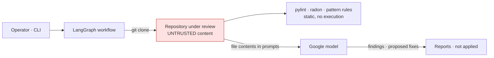

# Threat model

Scope: the command-line reviewer (`main.py` → `src/`), the LangGraph workflow
and its nodes, the tools they call (pylint and radon over files on disk,
GitPython to clone), the model calls to Google, and the container. Out of
scope: what Google does with the prompts, and the correctness of the model's
review — it is a model's opinion and the reports say so.

What was open when the work started is stated per threat; "now" is the state
on the `production-readiness` branch after PR #1 and the follow-up commits.

## What it holds

| Asset | Where | Why it matters |
|---|---|---|
| The code under review | a clone on disk, then in prompts | Third-party or proprietary source; it leaves the machine for the model provider |
| `GOOGLE_API_KEY` | environment | Billable; one call per file in the logic review, one per finding when fixes are requested |
| Reports | `./reports` | Contain file paths, code excerpts and the model's claims about them |
| Git credentials on the operator's machine | the operator's environment | `commit_and_push` exists in `tools/` and would use them if anything called it; nothing does |

## Trust boundaries

The reviewed repository is the untrusted party. It is read, never executed,
and its text is placed in front of a model that then describes it — and, on
request, proposes replacements that no one applies.

## Threats

| # | Threat | Was | Now | Remaining |
|--:|---|---|---|---|
| T1 | The reviewed code steers the model | File content was interpolated into a `ChatPromptTemplate`; a dict literal crashed the reviewer, and any file could rewrite the prompt | Content is passed as message data; the system prompt names it untrusted ([ADR 0002](adr/0002-the-graph-wires-real-nodes-behind-one-model-seam.md)) | A file can still argue with the model. Findings and proposals are text in a report; the reader is the control |
| T2 | A model-written "fix" lands in the repository | `--auto-fix` on by default; `commit_and_push` present in `tools/` | Fixes are proposals in the report, `applied: False`, off by default; no node writes to the repository or calls the push helper; a test asserts the file is unchanged ([ADR 0003](adr/0003-fixes-are-proposals-off-by-default.md)) | The helper exists. Wiring it needs a real approval step |
| T3 | Reviewed code runs on the operator's machine | — | Still none: pylint and radon are static; `run_unit_tests` in `tools/testing.py` is a stub that runs nothing; the clone is `depth=1` and hooks are not cloned | If a future node runs a project's tests, it must do so in a sandbox — and this table must change first |
| T4 | Files outside the repository are sent to the model | `--files` accepted any path, read directly | Unchanged: the operator names the paths, on the operator's machine, under the operator's key. In the container, only mounted paths are reachable | A shared CI runner would need an allowlist rooted at the clone |
| T5 | Cost amplification | One logic-review call per file; with fixes on by default, one more per finding (had the run not stopped at the interrupt) | Fixes are opt-in; the counts are the file and finding counts | No budget or cap on either |
| T6 | Startup depends on a secret | The model was built at import, so the tool needed `GOOGLE_API_KEY` to print `--help` | Built on first use; the image runs `--help` and the static stages without a key | — |
| T7 | Vulnerable or needless dependencies | ~30 pinned packages, most imported by nothing | Runtime list matches the imports; a test enforces it; `pip-audit` and `bandit` fail the build ([ADR 0004](adr/0004-a-cli-image-with-what-the-code-imports.md)) | Ranges, not exact pins: an audit failure is the signal to pin |
| T8 | Root container | No image | Two-stage image, uid 10001, `git` as the only extra package | Reports are owned by uid 10001 |
| T9 | Findings that are not findings | Twelve stub nodes shadowed the implementations; the "review" was fixed values | The real nodes are wired and CI checks they stay wired | The logic review still yields one generic finding per file from the model's prose |
| T10 | The system is mistaken for what its README said it was | "The World's First Cognitive Code Architect", an "Audit Certified" badge linking to OWASP, "surgical code repairs before they ever reach production" | The README describes pylint, radon, pattern rules, one model call per file and proposals no one applies; the badge is gone; the repository's origin is stated | — |

## Failure modes that fail closed

- No `GOOGLE_API_KEY`: `--help`, cloning and the static stages run; the first
  model call raises and is reported.
- A model reply without a code block, or with one that does not parse: recorded
  as such, never presented as a fix.
- A provider error during proposals: recorded in `errors`; the report is still
  written.
- `graph.py` defining a node stub again, or dropping the import of the real
  nodes: CI fails.
- A declared dependency nothing imports: a test fails.
